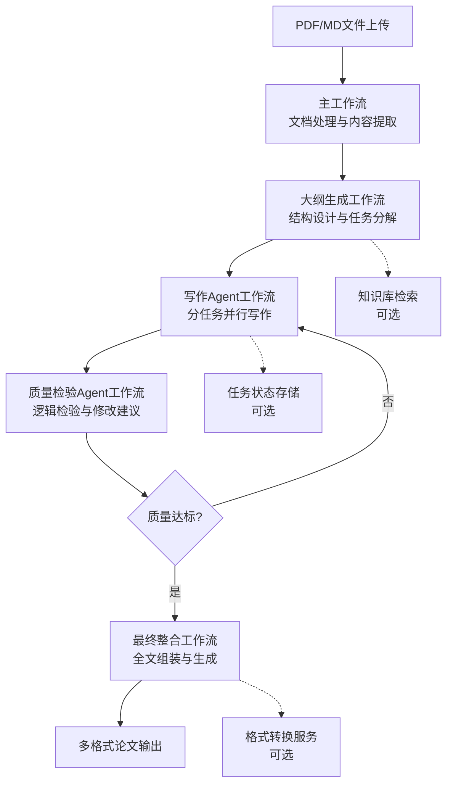

# n8n论文写作工作流详细概览

## 🎯 工作流系统架构图



## 📋 工作流详细说明

### 1. 主工作流 (paper-writing-main-workflow.json)

**功能：文档处理与内容提取**

#### 核心节点说明：
- **文件上传触发器**：支持PDF和Markdown文件
- **文件类型判断**：自动识别PDF或MD格式
- **PDF内容提取**：使用pdf-parse库提取文本和页面信息
- **Markdown内容提取**：使用marked库解析结构化内容
- **LLM内容分析**：智能分析文档主题、关键点和概念
- **生成易读Markdown**：输出结构化分析报告

#### 关键配置：
```json
{
  "llmApiUrl": "https://api.openai.com/v1/chat/completions",
  "llmModel": "gpt-4",
  "outlineWorkflowUrl": "http://localhost:5678/webhook/outline-generation"
}
```

#### 输出结果：
- 文档分析报告(MD格式)
- 结构化内容数据
- 论据素材清单
- 自动触发大纲生成流程

---

### 2. 大纲生成工作流 (paper-outline-generation-workflow.json)

**功能：基于内容分析生成论文大纲并分解写作任务**

#### 核心节点说明：
- **大纲生成触发器**：接收主工作流传递的分析数据
- **构建知识库搜索查询**：基于主题和概念生成搜索查询
- **知识库检索**：可选的外部知识增强(如无知识库则跳过)
- **LLM大纲生成**：根据学术规范生成结构化大纲
- **大纲结果处理**：质量检查和任务分解
- **生成大纲Markdown**：输出易读的大纲文档

#### 关键配置：
```json
{
  "knowledgeBaseUrl": "http://localhost:3000/api/knowledge-search",
  "writingWorkflowUrl": "http://localhost:5678/webhook/writing-agent",
  "llmModel": "gpt-4"
}
```

#### 质量检查机制：
- 标题完整性检查
- 章节结构合理性验证
- 内容要求明确性评估
- 自动任务分解和优先级设置

#### 输出结果：
- 结构化论文大纲
- 写作任务分解列表
- 质量评估报告
- 自动触发写作Agent

---

### 3. 写作Agent工作流 (writing-agent-workflow.json)

**功能：分任务并行写作处理**

#### 核心节点说明：
- **写作任务触发器**：接收大纲工作流的任务分解
- **任务队列初始化**：按优先级和依赖关系排序任务
- **分发当前批次任务**：支持批量并行处理
- **LLM章节写作**：基于大纲要求生成章节内容
- **写作结果处理**：基础质量检查和格式化
- **批次进度检查**：监控完成进度并决定下一步

#### 关键配置：
```json
{
  "maxConcurrentTasks": "3",
  "reviewWorkflowUrl": "http://localhost:5678/webhook/quality-review",
  "taskStatusUrl": "http://localhost:3000/api/task-status"
}
```

#### 任务管理机制：
- 智能批次分配(避免API过载)
- 依赖关系处理
- 失败任务重试
- 实时进度跟踪

#### 质量预检查：
- 字数符合度检查
- 段落结构检查
- 引用标记检查
- 内容完整性验证

---

### 4. 质量检验Agent工作流 (quality-review-agent-workflow.json)

**功能：全面质量审核与修改建议**

#### 核心节点说明：
- **质量审核触发器**：接收写作Agent的内容
- **审核流程初始化**：确定审核级别和标准
- **LLM质量审核**：多维度质量评估
- **审核结果处理**：问题分析和决策制定
- **审核决策分支**：根据质量决定批准或修订
- **生成修订任务**：详细的修改指令生成

#### 质量评估维度：
- **逻辑结构**(1-10分)：论证逻辑、前后连贯性
- **内容质量**(1-10分)：学术规范、论据充分性
- **语言表达**(1-10分)：用词准确、表达专业性
- **结构完整性**(1-10分)：章节结构、内容完整度
- **引用规范**(1-10分)：引用格式、来源可靠性
- **原创性**(1-10分)：学术价值、避免重复冗余

#### 关键配置：
```json
{
  "reviewerModel": "gpt-4",
  "maxRevisionCycles": "3",
  "assemblyWorkflowUrl": "http://localhost:5678/webhook/final-assembly"
}
```

#### 修订控制机制：
- 问题严重程度分级(critical/major/minor)
- 修订次数限制(防止无限循环)
- 强制批准机制(超过修订限制时)
- 人工干预触发点

---

### 5. 最终整合工作流 (final-assembly-workflow.json)

**功能：收集已批准内容，进行全局一致性检查并生成最终论文**

#### 核心节点说明：
- **最终整合触发器**：接收已批准的章节内容
- **存储已批准内容**：内容收集和管理
- **评估整合准备度**：检查论文完整性
- **LLM全局一致性审核**：跨章节一致性检查
- **执行论文整合**：组装完整论文结构
- **生成多格式输出**：输出MD/PDF/DOCX格式

#### 整合准备度评估：
- 章节完成率检查(默认80%阈值)
- 章节连续性验证
- 质量分布分析
- 缺失内容识别

#### 全局一致性检查：
- **术语统一性**：确保专业术语一致使用
- **逻辑连贯性**：检查章节间逻辑关系
- **格式统一性**：统一引用格式、图表编号
- **风格一致性**：保持全文语言风格统一

#### 关键配置：
```json
{
  "assemblyModel": "gpt-4-turbo",
  "minCompletionRate": "0.8",
  "storageApiUrl": "http://localhost:3000/api/content-storage",
  "outputFormatUrl": "http://localhost:3000/api/format-output"
}
```

## 🔧 配置管理最佳实践

### 环境变量统一管理

建议在每个工作流中使用相同的配置节点名称，便于统一管理：

```json
{
  "llmApiUrl": "https://api.openai.com/v1/chat/completions",
  "llmModel": "gpt-4",
  "temperature": "0.2",
  "maxTokens": "2000"
}
```

### Webhook URL配置

确保所有工作流间的URL配置正确：

```json
{
  "mainWorkflowUrl": "http://localhost:5678/webhook/paper-upload-trigger",
  "outlineWorkflowUrl": "http://localhost:5678/webhook/outline-generation",
  "writingWorkflowUrl": "http://localhost:5678/webhook/writing-agent",
  "reviewWorkflowUrl": "http://localhost:5678/webhook/quality-review",
  "assemblyWorkflowUrl": "http://localhost:5678/webhook/final-assembly"
}
```

### 可选服务配置

如果不使用可选服务，可以将URL设置为空或注释掉相关节点：

```json
{
  "knowledgeBaseUrl": "",
  "storageApiUrl": "",
  "outputFormatUrl": ""
}
```

## 📊 监控和调试

### 关键监控指标

1. **处理时间监控**
   - 每个工作流的执行时间
   - API调用响应时间
   - 总体处理时长

2. **质量指标监控**
   - 平均质量评分
   - 修订次数分布
   - 人工干预频率

3. **错误率监控**
   - API调用失败率
   - 工作流执行失败率
   - 格式转换失败率

### 调试技巧

1. **启用详细日志**：在Code节点中添加console.log语句
2. **分步执行**：手动触发单个工作流进行测试
3. **数据验证**：在关键节点添加数据结构验证
4. **错误模拟**：故意制造错误测试错误处理机制

## 🚀 性能优化建议

### API调用优化
- 使用适当的temperature设置(0.2-0.4)
- 合理控制max_tokens参数
- 实施API调用重试机制
- 考虑使用更快的模型(如gpt-3.5-turbo)用于质量预检

### 并发控制
- 根据API限制调整maxConcurrentTasks
- 实施任务优先级队列
- 添加任务间延时控制
- 监控API使用配额

### 内存管理
- 定期清理大型数据对象
- 使用流式处理处理大文件
- 实施分页处理机制
- 优化数据传递格式

## 🔄 扩展开发指南

### 添加新文档格式支持

1. **修改主工作流**：
   - 在文件类型判断节点添加新格式检测
   - 添加新的内容提取节点
   - 更新内容合并逻辑

2. **测试验证**：
   - 准备新格式的测试文件
   - 验证提取内容的准确性
   - 确保后续流程兼容性

### 集成新LLM服务

1. **API适配**：
   - 修改请求格式
   - 适配响应解析
   - 处理错误码差异

2. **功能验证**：
   - 测试文档分析准确性
   - 验证大纲生成质量
   - 检查写作内容质量

### 自定义质量标准

1. **修改评分逻辑**：
   - 调整各维度权重
   - 添加领域特定检查
   - 实施自定义评分算法

2. **配置管理**：
   - 将质量标准外部化配置
   - 支持不同类型论文的不同标准
   - 实施A/B测试机制

---

## 📝 总结

这套n8n工作流系统实现了从文档分析到最终论文生成的完整自动化流程。通过模块化设计，每个工作流专注于特定功能，既保证了系统的可维护性，又提供了良好的扩展性。

关键优势：
- ✅ **端到端自动化**：最小化人工干预
- ✅ **质量控制**：多层次质量检验机制
- ✅ **容错能力**：完善的错误处理和恢复
- ✅ **可扩展性**：模块化架构便于功能扩展
- ✅ **可配置性**：支持多种参数和服务配置

使用时请根据实际需求调整配置参数，并始终遵守学术诚信和版权相关规定。