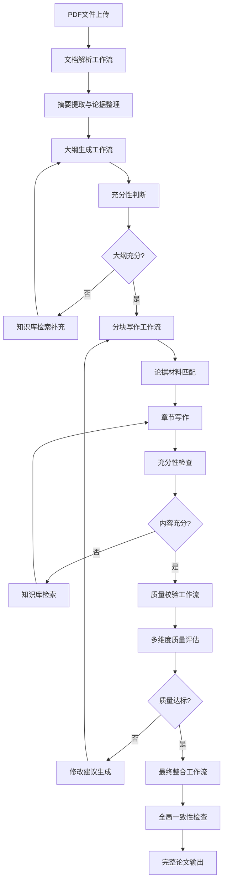

# 学术论文写作工作流系统

## 系统概述

这是一个基于Coze工作流的学术论文写作系统，具有以下核心功能：

1. **PDF文档解析与摘要提取** - 从用户上传的PDF文件中提取摘要和论据材料
2. **智能大纲生成** - 基于摘要和论据设计文章结构，并进行充分性判断
3. **分块写作与材料补充** - 逐块写作，自动检索补充材料并管理引用
4. **循环质量校验** - 多层次质量检查，自动修改直至达标
5. **最终整合输出** - 生成完整的学术论文

## 工作流架构

## 核心特性

### 1. 智能文档解析
- 支持PDF文件自动解析
- 智能提取文章摘要
- 自动整理论据材料
- 中文内容处理优化

### 2. 充分性判断机制
- 基于知识库的大纲充分性评估
- 论据材料充分性检查
- 自动检索补充机制
- 引用管理自动化

### 3. 循环质量提升
- 多维度质量评估（逻辑、内容、语言、结构、引用、原创性）
- 智能修改建议生成
- 自动修订循环
- 质量达标自动停止

### 4. 学术规范遵循
- 英文学术写作标准
- 引用格式规范化
- 参考文献管理
- 学术诚信保障

## 工作流文件说明

1. **document-parsing-workflow.json** - 文档解析与摘要提取
2. **outline-generation-workflow.json** - 大纲生成与充分性判断
3. **section-writing-workflow.json** - 分块写作与材料补充
4. **quality-review-workflow.json** - 质量校验与修改建议
5. **final-assembly-workflow.json** - 最终整合与输出
6. **knowledge-base-workflow.json** - 知识库检索服务
7. **config.json** - 系统配置文件

## 使用说明

1. 将所有工作流文件导入到Coze平台
2. 配置API密钥和知识库连接
3. 上传PDF文档触发工作流
4. 系统自动完成整个写作流程
5. 获取最终学术论文

## 配置要求

- OpenAI API密钥
- 知识库API连接（可选）
- 文件存储服务
- 支持中文处理的LLM模型